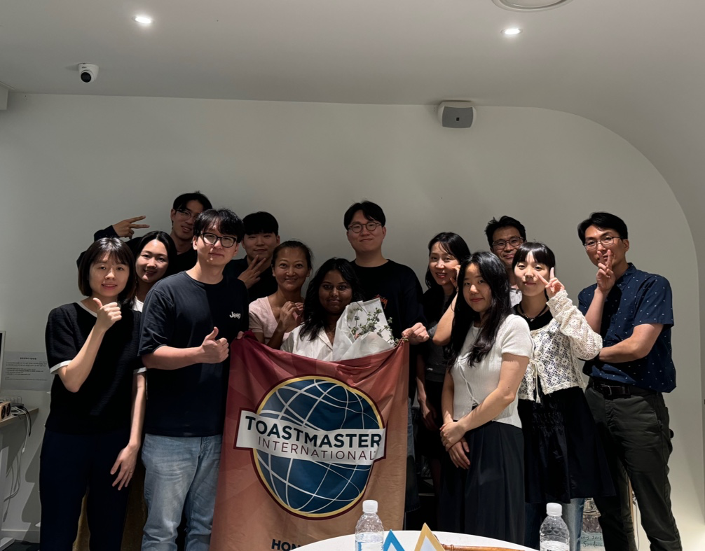

# Introduction 

Let's discover **how to join HDTM meetings**. hahaha

## Getting Started

Get started by **joining our [kakao chatroom](https://open.kakao.com/o/ggM3CWFb)**.

Or **try contacting our official [instagram account](https://www.instagram.com/hongdaetoastmasters/)**

### What you'll need

Be prepared to meet highly motivated individuals every Monday at 7:30 p.m.!
We hold our meetings at [Aank Hotel Hongdae(B1)](https://www.google.com/maps/place/%EC%95%84%EB%8A%91%ED%98%B8%ED%85%94+%ED%99%8D%EB%8C%80%EC%A0%90/data=!3m1!4b1!4m9!3m8!1s0x357c98dc98502d37:0x30914c6d11b603df!5m2!4m1!1i2!8m2!3d37.5555353!4d126.920378!16s%2Fg%2F11s911n39m?entry=ttu&g_ep=EgoyMDI0MTIxMS4wIKXMDSoASAFQAw%3D%3D)

## Now Join the Meeting 🎉🎉🎉

During your first meeting, you will be asked to briefly introduce yourself in English. We encourage you to join our meetings!

